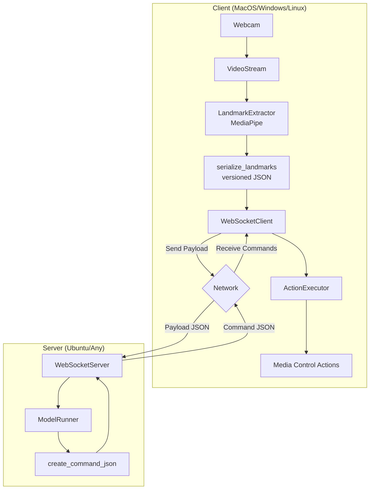

# GestureDetection

A real-time hand gesture recognition system for controlling media playback using computer vision and WebSocket communication.

## Overview

GestureDetection is a client-server application that uses MediaPipe for hand tracking and a model-ready inference pipeline to enable hands-free control of media applications. The system captures hand landmarks from a webcam, processes them on a server, and executes corresponding actions on the client.

## Features

- **Real-time Hand Tracking**: Uses MediaPipe for accurate hand landmark detection
- **ML-Ready Pipeline**: Versioned payloads prepared for model-based inference
- **Client-Server Architecture**: Decoupled processing using WebSocket communication
- **Low Latency**: Optimized for real-time performance at 30 FPS
- **Extensible Design**: Modular architecture ready for AI-based enhancements

## Architecture



## Project Structure

```
GestureDetection/
├── client/                      # Client-side code
│   ├── actions/
│   │   └── action_executor.py  # Execute actions based on gestures
│   ├── capture/
│   │   ├── landmark_extractor.py  # MediaPipe landmark extraction
│   │   └── video_stream.py     # Video capture and streaming
│   ├── client_main.py           # Client entry point
│   ├── ws_client.py             # WebSocket client
│   └── data_collector.py        # Training data collection tool
├── core/                        # Model interfaces and mocks
│   ├── gesture_model.py         # Model interface
│   └── mock_gesture_model.py    # Placeholder predictor
├── server/                      # Server-side code
│   ├── modules/
│   │   ├── gestures.py          # Legacy heuristics (not used)
│   │   ├── posture.py           # (Future) Full-body pose analysis
│   │   └── context_manager.py   # (Future) AI-based context filtering
│   └── ws_server.py             # WebSocket server
├── shared/                      # Shared utilities
│   ├── schemas.py               # Data serialization
│   └── utils.py                 # (Future) Shared utilities
├── requirements.txt             # Python dependencies
└── README.md                    # This file
```

## Installation

### Prerequisites

- Python 3.8 or higher
- Webcam
- Network connection (for client-server communication)

### Setup

1. **Clone the repository**
   ```bash
   git clone <repository-url>
   cd GestureDetection
   ```

2. **Create a virtual environment** (recommended)
   ```bash
   python -m venv venv
   source venv/bin/activate  # On Windows: venv\Scripts\activate
   ```

3. **Install dependencies**
   ```bash
   pip install -r requirements.txt
   ```

## Usage

### Running the Server

On your server machine (or localhost for testing):

```bash
python -m server.ws_server
```

The server will start listening on `ws://0.0.0.0:8765` by default.

### Running the Client

1. **Configure the server address** in `client/client_main.py`:
   ```python
   SERVER_HOST = "your-server-ip"  # e.g., "192.168.1.10" or "localhost"
   SERVER_PORT = 8765
   ```

2. **Start the client**:
   ```bash
   python -m client.client_main
   ```

3. **Use gestures**:
    - The current model is a mock and will not emit gestures yet.
    - Press 'q' in the video window to quit.


## Data Collection (Optional)

To collect training data for future AI enhancements:

```bash
python -m client.data_collector
```

Follow the on-screen prompts to record gesture sequences. Data will be saved in the `training_data/` directory.

## Technical Stack

- **Computer Vision**: MediaPipe (Google)
- **Video Processing**: OpenCV
- **Communication**: WebSockets (websockets library)
- **Numerical Computing**: NumPy
- **Language**: Python 3.8+

## Gesture Detection Algorithm

The current implementation is model-first and ships with a mock predictor while the dataset is prepared:

1. **Landmark Extraction**: MediaPipe detects hand and pose landmarks in 3D space
2. **Payload Versioning**: Client sends versioned JSON for stable evolution
3. **Model Inference**: A plug-in model will classify gestures (mock returns no gesture)
4. **Action Dispatch**: Recognized gestures map to client actions

## Future Enhancements

### AI-Based Context Filtering
- Integrate pose detection to filter gestures based on hand position relative to body
- Prevent false positives (e.g., fist near mouth while eating/drinking)
- Multi-frame stability verification

### Full-Body Pose Integration
- Detect full-body gestures using MediaPipe Pose
- Enable multi-person tracking in shared spaces
- Posture-based gesture modifiers

### Machine Learning
- Train custom gesture classifier using collected data
- Add model loading/inference pipeline on the server
- Personalized gesture recognition

### Enhanced Actions
- Integration with OS-level media controls
- Support for multiple applications (Spotify, YouTube, etc.)
- Customizable gesture-to-action mapping

## Performance Considerations

- **Frame Rate**: Target 30 FPS for smooth real-time operation
- **Network Latency**: Local network recommended for minimal delay
- **CPU Usage**: MediaPipe is optimized for real-time performance
- **False Positive Reduction**: Model confidence thresholds and post-processing

## Troubleshooting

### Camera Not Opening
- Ensure no other application is using the webcam
- Check camera permissions in system settings
- Try changing camera index in `VideoStream` (default is 0)

### Server Connection Failed
- Verify server is running and accessible
- Check firewall settings
- Ensure correct IP address and port in client configuration

### Gestures Not Detected
- This is expected while the mock model is active
- Ensure good lighting conditions for future datasets
- Verify the client is sending versioned payloads

## Contributing

This project is designed with extensibility in mind. Key areas for contribution:
- Additional gesture patterns
- AI-based filtering implementations
- Cross-platform action execution
- Performance optimizations

## License

[Add your license here]

## Author

Alfonso Garre

---

**Note**: This project is designed for portfolio demonstration and educational purposes. For production use, consider implementing proper error handling, logging, security measures, and OS-specific media control integrations.
